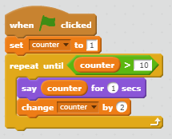
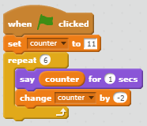
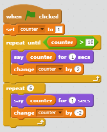

# Exercises: Unscratch

## Goal

Your objective is to translate the following scratch programs into C. Interpret every `say` instruction as `printf` and end every `printf` with a new line.

## Getting started

If you haven't done so yet, create a directory called `practice` in your workspace:

    mkdir ~/workspace/practice

Create a directory `unscratch` in `practice` and step into it:

    mkdir ~/workspace/practice/unscratch
    cd ~/workspace/practice/unscratch

## Counter

Take a look at the following scratch program:

###Step 1:
Before you start coding, try to write down the output of this program.
You can verify your answer here: [https://scratch.mit.edu/projects/183253212/](https://scratch.mit.edu/projects/183253212/)

###Step 2:
Create a new file called `counter1.c` in the directory `unscratch` and recreate the scratch program above in C.

## Counter 2

Take a look at the following scratch program:

###Step 1: 
Before you start coding, try to write down the output of this program.
You can verify your answer here: [https://scratch.mit.edu/projects/183260096/](https://scratch.mit.edu/projects/183260096/)

###Step 2:
Create a new file called `counter2.c` in the directory `unscratch` and recreate the scratch program above in C.

## Counter 3

###Step 1:
Before you start coding, try to write down the output of this program.
You can verify your answer here: [https://scratch.mit.edu/projects/183260929/](https://scratch.mit.edu/projects/183260929/)

###Step 2:
Create a new file called `counter3.c` in the directory `unscratch` and recreate the scratch program above in C.
