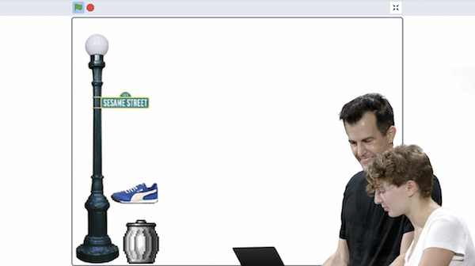
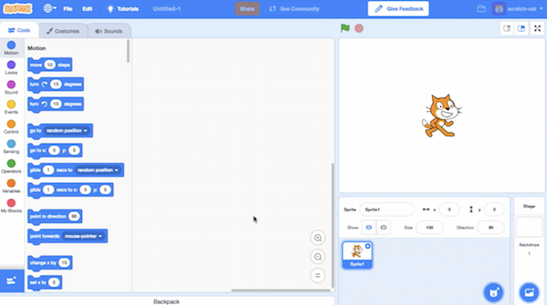
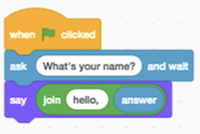
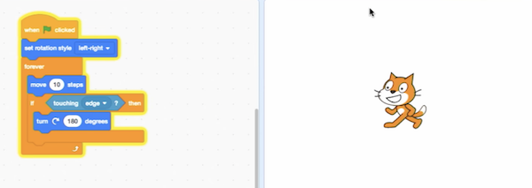
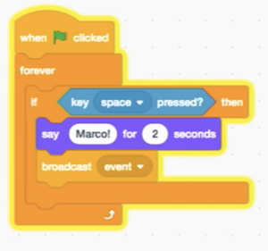
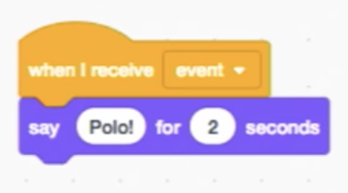
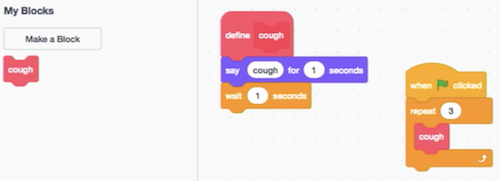
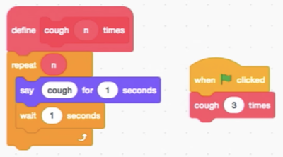

## Scratch

*   We can write programs with the building blocks we just discovered:

    *   functions
    *   conditions
    *   Boolean expressions
    *   loops

*   We'll use a graphical programming language called [Scratch](https://scratch.mit.edu/), where we'll drag and drop blocks that contain instructions.

*   Later in our course, we'll move onto textual programming languages like C, and Python, and JavaScript. All of these languages, including Scratch, has more powerful features like:

    *   variables
        *   the ability to store values and change them
    *   threads
        *   the ability for our program to do multiple things at once
    *   events
        *   the ability to respond to changes in our program or inputs
    *   ...

*   David's first program in Scratch was [Oscartime](https://scratch.mit.edu/projects/76196420/), which we play with a volunteer. The game involves clicking and dragging trash that falls from the top of the screen:  

    

    *   We can already start to decompose the program for the game:

        *   The animation of the trash can is a sequence of 3 images, displayed one after another.

        *   The score was being stored in a variable, and increased with each piece of trash we dragged.

*   The programming environment for Scratch looks like this:  

    {:.w400}

    *   On the left, we have puzzle pieces that represent functions or variables, or other concepts, that we can drag and drop into our instruction area in the center.

    *   On the right, we have a stage that will be shown by our program to a human, where we can add or change backgrounds, characters (called sprites in Scratch), and more.

*   We can drag a few blocks to make Scratch say "hello, world":  

    {:.w400}

    *   The "when green flag clicked" block is the start of our program, and below it we've snapped in a "say" block and typed in "hello, world".

*   We can also drag in the "ask and wait" block, with a question like "What's your name?", and combine it with a "say" block for the answer:  

    {:.w400}

*   We can use the "join" block to combine two phrases so Scratch can say "hello, David":  

    {:.w200}

    *   Notice that we can nest instructions and variables.

*   We can try to make Scratch (the name of the cat) say meow:  

    {:.w200}

    *   But when we click the green flag, we only hear the meow sound once. Our first bug, or mistake! It turns out that computers can do things really quickly, so it went to each block, started playing the sound, and moved on to the next block. So all three "meow"s overlapped and sounded like one.

*   We can fix this with "play sound until done", and even "wait" before we say meow again:  

    {:.w200}
	
*   We can copy and paste these blocks over and over again, but our program can have better design if we use a loop, like the "forever" block:  

    {:.w200}

*   We have another program, [counting sheep](https://scratch.mit.edu/projects/26329219/):  

    {:.w400}

    *   Here, "counter" is a variable where we store a value, and increase it every time our sheep says it.

*   We can have our sheep double the counter each time, and if we wait a while, eventually the sheep gives up and says "infinity". Since computers has to store values physically, there is only a finite number of bits. The programmer (in this case, the writers of the Scratch language) will have to decide on a limit to how many bits are used for each type of variable, as well as how to handle reaching those limits.

*   We can tinker with other blocks, and have Scratch meow when we "pet" him with our mouse pointer:  

    {:.w300}

    *   We need the "forever" block because, otherwise, our program would check that condition at the very beginning, and then stop.

*   We can also use the "if else" block to have different sounds play depending on the condition.

*   With a few more blocks, we can make Scratch move on the screen, left and right:  

    

*   And if we find some images of Scratch with his legs in various positions, we can even simulate walking:  

    

    *   In another tab called "Costumes", we can set what Scratch looks like in each frame. And animation is just a more complex version of this.

*   By exploring what other blocks we have available, we can have Scratch follow us with blocks like "point toward mouse cursor".

*   We can also have multiple scripts, or snippets of code, in the same program:  

    

    *   With the space bar, we can change the value of the variable called "muted", and the second script will play the sound or not depending on the value of "muted".

*   With events, we can have two sprites, each with their own script, interact with each other:  

    {:.w200}

    {:.w200}

    *   We put these sets of blocks on different sprites, and now when we click the green flag, one says "Marco" and the other says "Polo" on its own!

*   One sign of a poorly designed program is one where we copy and paste the same code over and over again. The acronym of DRY, or "Don't Repeat Yourself", is a good reminder. For example, instead of duplicating the same blocks, we can use a "repeat" block to do something over and over again.

*   The next step is abstracting away some of our code into a function. We can make a block called "cough" and put some blocks inside it:  

    

    *   Now, all of our sprites can use the same "cough" block, in as many places as we'd like.

*   We can even put a number of times into our cough function, so we only need a single block to cough any number of times:  

    {:.w300}

*   As we use higher-level programming languages, we'll see more examples of how collections of code written by others, called libraries, will be useful for us to write programs of our own.

*   We play more examples of interactive games, written by former students.

*   Welcome aboard!
