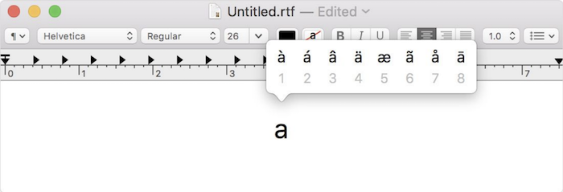

## Binary

*   A computer, at the lowest level, stores data in binary, where there are just two digits, 0 and 1. And that maps to how our computers use electricity, which is easy to turn off or on.

*   As humans, we know the following represents one hundred and twenty-three.

        1 2 3

    *   The `3` is in the ones column, the `2` is in the tens column, and the `1` is in the hundreds column.

    *   So `123` is 100×1 + 10×2 + 1×3 = 100 + 20 + 3 = 123.

*   In binary, with just two digits, we have powers of two for each place value:

    <pre>4 2 1
    <b>0 0 0</b>
    </pre>

    *   This would still be equal to 0.

*   Now if we change the binary value to, say, `0 1 1`, the decimal value would be 3.

    <pre>4 2 1
    <b>0 1 1</b>
    </pre>

*   With enough bits, or binary digits, computers can count much higher.

*   To represent letters, all we need to do is decide how numbers map to letters. Some humans, many years ago, collectively decided on a standard mapping called [ASCII](https://en.wikipedia.org/wiki/ASCII). The letter "A", for example, is the number 65, and "B" is 66, and so on.

    *   A byte is 8 bits, and we use that as a unit to manage bits. The number 72, for example, fits into one byte.

*   And computer programs know, based on the context of its code, whether the binary numbers should be interpreted as numbers, or letters, or even other media.

## Representing data

*   **Abstraction** is a concept in computer science where some low-level implementation (such as how data is ultimately stored in binary) is simplified or taken for granted, so we can use that implementation at a higher level (such as representing letters, that we can then use in our programs).

*   On a standard American keyboard, letters with accent marks, and many other symbols and characters, aren't visible:

	{:.w400}
	
*   To solve that problem, computers can represent letters with standards in addition to ASCII.

*   It turns out that both letters with accent marks, as well as emoji, can be represented as characters with multiple bytes, with a standard called [Unicode](https://en.wikipedia.org/wiki/Unicode) (one specific version of which is called UTF-8).

	{:.w400}
	
	{:.w200}

    * When we receive an emoji, our computer is actually just receiving a decimal number like `128514` (`11111011000000010` in binary, if you can read that more easily) that it then maps to the image of the emoji.

*   Computers can also use binary to represent images. With three bytes, each representing some amount of red, green, and blue, we can represent millions of colors:

    {:.w300}
	
    *   The red, green, and blue values are combined to get a light yellow color:  

        {:w100}

*   Each image is comprised of thousands or millions of pixels, or squares of colors, that we can see once we zoom in far enough:

	{:.w300}

*   And videos are just many, many images displayed one after another, at some number of frames per second.

*   On newer iPhones, the "Animoji" feature is just lots of images, generated and displayed one after another:

	{:.w500}

*   We can think of videos as abstractions over images, images as abstractions over pixels, and pixels as abstractions over bits.
