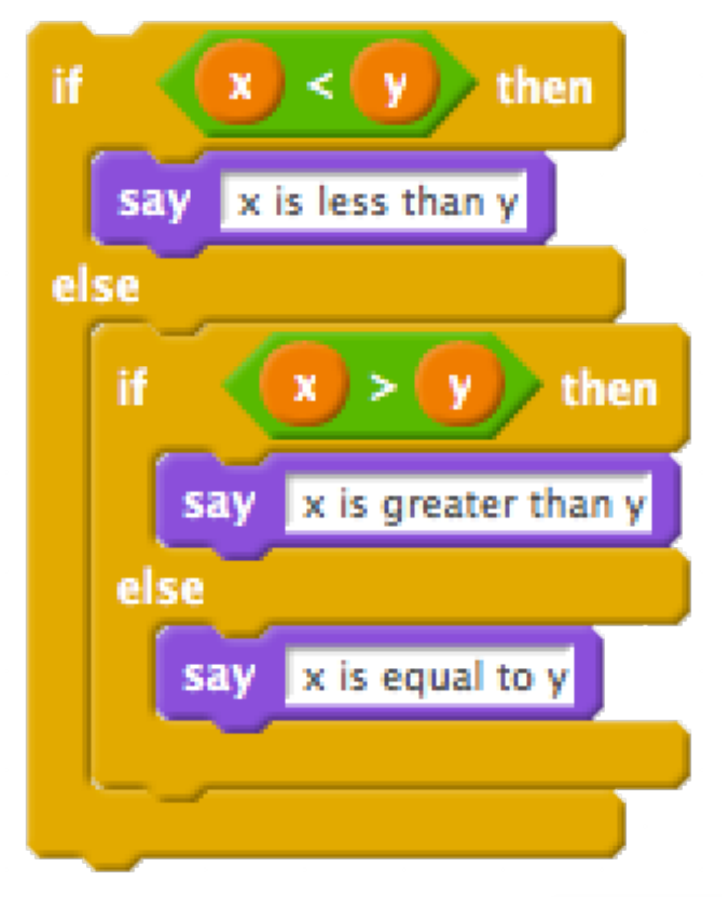

* Last time, we also created a nested set of conditions in Scratch:

	{:.w200}

* In C, the equivalent code will look like this:

		if (x < y)
		{
		    printf("x is less than y\n");
		}
		else if (x > y)
		{
		    printf("x is greater than y\n");
		}
		else
		{
		    printf("x is equal to y\n");
		}

	* In our code, we assume that `x` and `y` have already been initialized or set to some other values beforehand.

	* We use the `if`, `else if`, and `else` keywords to denote the forks in the road, based on Boolean expressions. `else` simply captures all the cases that haven't fit into a previous condition.

	* Notice that curly braces, `{` and `}`, are used to wrap the lines of code that we want to run for each of the conditions if they are true. We also use indentation to make the lines of code more readable.
