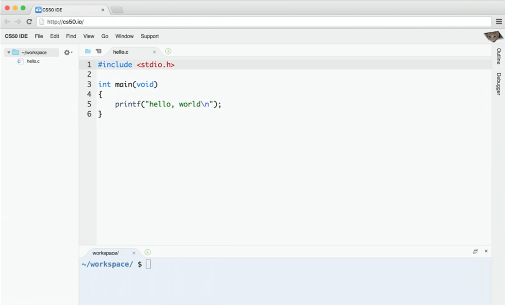
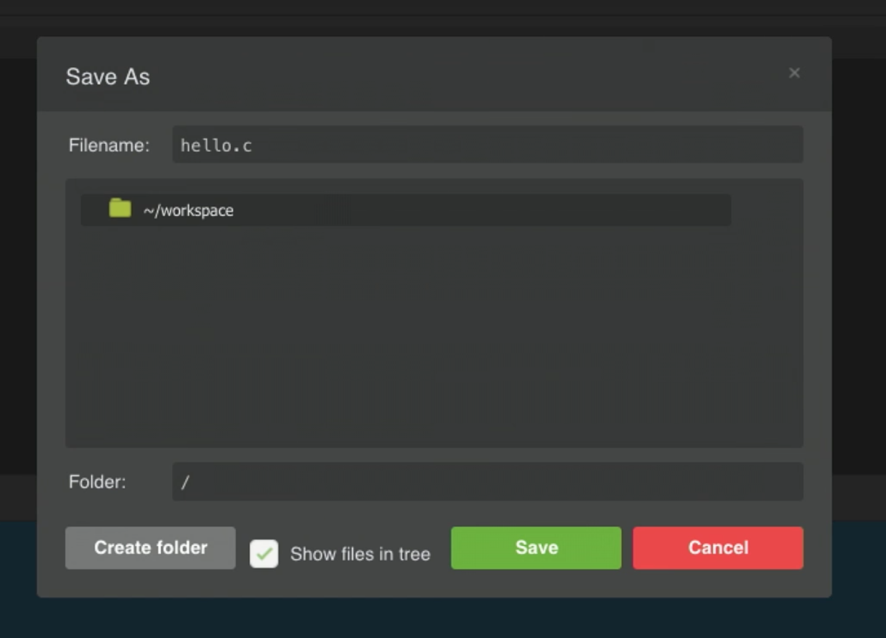
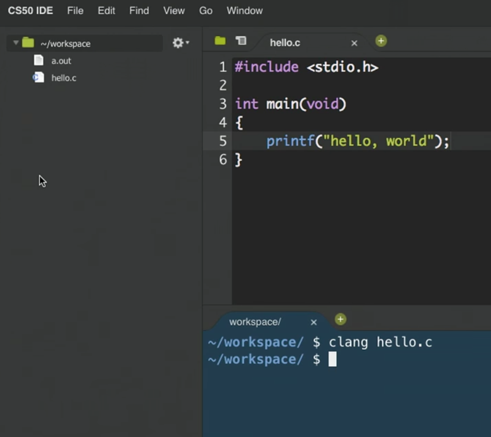
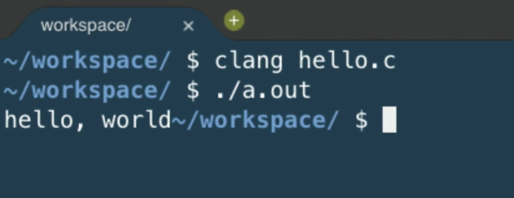
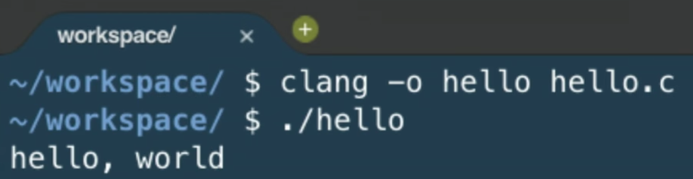
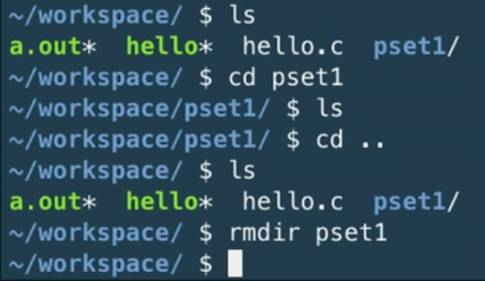

## Compiling

* So now we can write fairly basic programs in C. But computers only understand binary, so the *source code* that we write need to be converted to 0s and 1s, or *machine code* that a computer actually uses.

* This conversion is done by software called a *compiler*. We'll set everyone up with the same environment, or the same platform.

* This environment is the CS50 IDE (Integrated Development Environment), at [ide.cs50.io](http://ide.cs50.io). We can think of it as a web application, inside which we can write, compile, and run code:

	

	* We could each do this on our own computers, but setting up the editors, compilers, and other necessary software is a lot of work

	* Notice that we have a file browser to the left, where we can upload or download files from it, the code editor on the right, and the terminal at bottom right, into which we can type commands that our virtual environment will run.

	* We'll have instructions to log in for, but for now, just follow along!

	* By default, we have a `~/workspace` folder where we can save files to.

* First, let's create a new file. We'll use `File > Save`, and call our new file `hello.c`:

	{:.w400}

	* Since we are going to write a program in C, we will end our file with the `.c` extension. And we'll only use lowercase, with underscores or hyphens instead of space, by convention.

* We can type out our basic program, compile it, and run it:

	{:.w400}

	* Notice that the editor automatically makes our code colorful, or has syntax highlighting, to help us see patterns.

	* We'll type the command `clang hello.c` in the terminal at bottom of our IDE, to compile it. `clang` is a compiler that's been pre-installed for our use.

	* Nothing seems to happen, but no errors is good news. We can open the file browser and see that there's a new file, `a.out`, which is the machine code of our program.

* To run it, we can't just click on it. Instead, this program runs in a command-line environment, also known as the terminal. So we type `./a.out` to run it. `.` indicates the current directory:

	{:.w300}

* We see the output of our program, but the next line of our terminal prompt is on the same line. We needed to add `\n` in our source code, which is a special, escaped character that adds a new line to what we printed to the terminal.

* Now we can save, compile, and run our program again. We can actually pass in command-line arguments to `clang`, or additional parameters that changes its behavior:

	{:.w300}
	
	* Here, we are telling `clang` to name the output file `hello`.

* There are other commands built into our environment that we can use:

	{:.w300}
	
	* `ls` lists the files in the current directory, which we see in blue in the terminal screen above.

	* `cd` lets us change our current working directory (as in `cd pset1`, which we can create new ones of with the file browser on the left. And to change to the parent directory, we can use `cd ..` to go up one level.

	* Finally, we can use `rmdir` to remove directories.

## Functions

* We take a volunteer to demonstrate how `printf` is a function we pass arguments to. David hands Sam, our volunteer, a piece of paper with what he wanted to be written on the screen, and Sam copied it to the screen for David. Functions in programming, too, can be considered similar in that we can just call them and use them.

* Some functions relating to input include:

	* `get_char` - gets a character from the user
	* `get_double`
	* `get_float`
	* `get_int`
	* `get_long_long`
	* `get_string`

* We'll test out `get_string` with the following program:

		#include <stdio.h>

		int main(void)
		{
		    string s = get_string("Name: ");
		    printf("hello, %s\n", s);
		}

	* On line 5, we are declaring, or creating, a new variable called `s`, of type `string`. And the value it will store is whatever `get_string` returns. Some functions like `printf` might not return any value, but other functions like `get_string` can. When we call `get_string`, we pass in `"Name: "` as an argument, so it knows what to prompt the user.

	* Next, we want to print out what was stored in our string `s`, so we use the `%s` syntax to include a string inside `printf`. And the string in question is `s`.

* Going back to our list of functions that collect input, we notice that there are other types of data built into C: `double`, `float`, and `long long`.

* Let's start with getting an integer:

	

	* We can save, compile, and run this file as `int.c`. We can use another tool in the IDE called `make` to compile it. By simply running `make int`, `make` will take the file `int.c` and use a compiler to compile it into `int`, which we can run with `./int`.

	* At first, we get several errors. Usually, we can start by fixing the first error, save, compile again, and repeat until our program compiles without errors.

	* The first error here is telling us that `get_int` isn't actually declared. In fact, it's defined in another library, or set of code we can include, alongside `stdio.h`. `get_int`, along with other functions, live in `cs50.h`, a library written by CS50 staff to help make tedious tasks easier. So we simply need to add `#include <cs50.h>` at the top of our file. (And the source code for the library is stored in a common place in the IDE, where the compiler knows to look for it.)

	* Now we can `make` our file again, and notice that we didn't provide the integer `i` into `printf` to plug into our string.

	* We add it, and our program compiles and runs as we'd expect, with this final code:

			#include <cs50.h>
			#include <stdio.h>

			int main(void)
			{
			    int i = get_int("Integer: ");
			    printf("hello, %i\n", i);
			}

	* The `get_int` function prompts the user over and over, until it receives an integer.

* Let's take a look at [ints.c](http://cdn.cs50.net/2017/fall/lectures/1/src1/ints.c.src):

		// Integer arithmetic

		#include <cs50.h>
		#include <stdio.h>

		int main(void)
		{
		    // Prompt user for x
		    int x = get_int("x: ");

		    // Prompt user for y
		    int y = get_int("y: ");

		    // Perform arithmetic
		    printf("%i plus %i is %i\n", x, y, x + y);
		    printf("%i minus %i is %i\n", x, y, x - y);
		    printf("%i times %i is %i\n", x, y, x * y);
		    printf("%i divided by %i is %i\n", x, y, x / y);
		    printf("remainder of %i divided by %i is %i\n", x, y, x % y);
		}

	* The first line, started with `//`, is a comment. Comment lines don't do anything, but are notes for future programmers.

	* In our small program, we first get two integers and store them as `x` and `y`.

	* Then, we print out these variables and various expressions that involve some arithmetic on them. Addition and subtraction are what we might expect. Multiplication is `*`, division is `/`, and the modulo (remainder) operator is `%`.

* We can compile and run our program, and notice that it's working for `x = 2` and `y = 2`. If we try `x = 1` and `y = 2`, we get a line that reads: `1 divided by 2 is 0`.

* It turns out that integers discard anything after the decimal point, if we try to store some number with a decimal into it. In this case, `1 / 2` should be `0.5`, but the decimal part is thrown away, and all we're left with is `0`.

* We can fix this in [floats.c](http://cdn.cs50.net/2017/fall/lectures/1/src1/floats.c.src), where we use variables of the type `float`, for floating-point arithmetic:

		// Floating-point arithmetic

		#include <cs50.h>
		#include <stdio.h>

		int main(void)
		{
		    // Prompt user for x
		    float x = get_float("x: ");

		    // Prompt user for y
		    float y = get_float("y: ");

		    // Perform division
		    printf("%f divided by %f is %f\n", x, y, x / y);
		}

	* Notice that we use `%f` instead of `%i`, to indicate that a float should be substituted in.

	* If we wanted to control the number of decimal points printed out, we could write `%.10f` where we want the variable to be substituted in.

	* If we simply used `%f` but passed in integers, the compiler would find it to be an error.

* Let's look at how we can use conditions:

		// Conditions and relational operators

		#include <cs50.h>
		#include <stdio.h>

		int main(void)
		{
		    // Prompt user for x
		    int x = get_int("x: ");

		    // Prompt user for y
		    int y = get_int("y: ");

		    // Compare x and y
		    if (x < y)
		    {
		        printf("x is less than y\n");
		    }
		    else if (x > y)
		    {
		        printf("x is greater than y\n");
		    }
		    else
		    {
		        printf("x is equal to y\n");
		    }
		}

	* All we did is what set up our program to use the example of conditions we say before.

* Let's look at [noswitch.c](http://cdn.cs50.net/2017/fall/lectures/1/src1/noswitch.c.src):

		#include <cs50.h>
		#include <stdio.h>

		int main(void)
		{
		    char c = get_char("Answer: ");

		    if (c == 'Y' || c == 'y')
		    {
		        printf("yes\n");
		    }
		    else if (c == 'N' || c == 'n')
		    {
		        printf("no\n");
		    }
		    else
		    {
		        printf("error\n");
		    }
		}

	* We get a character `c`, and compare it to either `Y` or `y`, or `N` or `n`. We use `==` for a comparison, since a single `=` assigns a value. And C uses `||` to represent a logical *or*, where only one of the expressions need to be true for that condition to be followed and `&&` for *and*, where both expressions must be true.

	* We could have had an `if` for `Y` and an `if` for `y`, but using one condition means that we don't need to copy and paste the code that should be run into two places. Correctness is one aspect of code, but design is another. Style, or the indentation, comments, and variable naming, is yet another aspect.

	* Note that we use single quotes around characters, to distinguish them from strings, which we use double quotes to indicate.

* Let's look at another way to implement this program:

		// switch

		#include <cs50.h>
		#include <stdio.h>

		int main(void)
		{
		    // Prompt user for answer
		    char c = get_char("Answer: ");

		    // Check answer
		    switch (c)
		    {
		        case 'Y':
		        case 'y':
		            printf("yes\n");
		            break;
		        case 'N':
		        case 'n':
		            printf("no\n");
		            break;
		    }
		}

	* A *switch* is another construct in C where the value of a variable is compared to various cases, and the indented code beneath a matching case will be executed.

	* Notice that we use `break` to indicate that the switch should end. Otherwise, once a matching case is found, all of the code below it will run.
