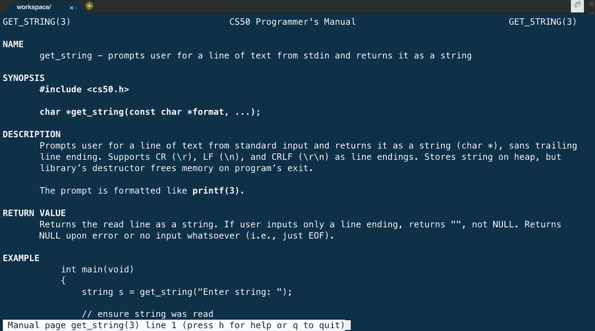
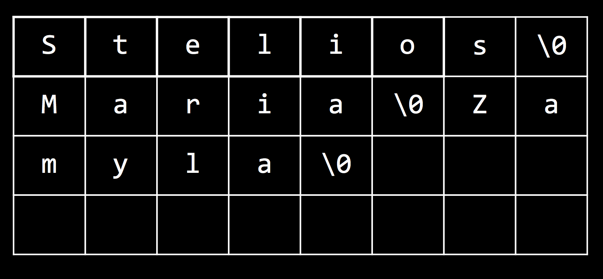

## Strings, Arrays

* There are several functions in the CS50 Library that allow us to get variables from the user:

	* `get_char`
	* `get_double`
	* `get_float`
	* `get_int`
	* `get_long_long`
	* `get_string`

* As implied by these function names, C supports various types of data that a variable can store:

	* `bool`
	* `char`
	* `double`
	* `float`
	* `int`
	* `long long`
	* `string`
	* ...

* Similarly, we can substitute different variable types into `printf` with different format codes:

	* `%c`
	* `%f`
	* `%i`
	* `%lld`
	* `%s`
	* ...

* To look up the documentation for these functions and format codes, among other information, we can use the built-in manual in the terminal.

* For example, we can type `man get_string` and see the following:

	

* But even that might be too hard to understand at first, so CS50 Staff have created [https://reference.cs50.net/](https://reference.cs50.net/), with explanations that might be a bit more friendly. And we can toggle the level of comfort with the checkbox that indicates as much.

* A TF in New Haven, Stelios, can store his name, character by character, in memory like so:

		| S | t | e | l | i | o | s |

* Indeed, a string is just an abstraction for a sequence of characters. Let's experiment with [`string0.c`](http://cdn.cs50.net/2017/fall/lectures/2/src2/string0.c.src):

		#include <cs50.h>
		#include <stdio.h>
		#include <string.h>

		int main(void)
		{
		    string s = get_string("input:  ");
		    printf("output: ");
		    for (int i = 0; i < strlen(s); i++)
		    {
		        printf("%c\n", s[i]);
		    }
		}

	* First, we start a `for` loop since we want to print each character of a string that's provided as input. The loop should end at the end of the string, so we can determine that with `strlen(s)`, a function that returns to us the length of the string.

	* Then, inside the loop, we use `%c` to print out each character. And to access each character, we use `i` as the index into the character in the string `s`: the first character is at index 0, the second at index 1, and so forth. The notation to get an item at a certain index in an array, or a list of values one after another, is what we see substituted into `printf`: `s[i]`.

	* And at top, we include a new library, `string.h`, that has various functions for working with strings, including `strlen`.

* Now, we can actually see how ASCII maps numbers to letters. *Typecasting* is casting, or converting, variables from a certain type, like `int`, to another, like `char`, or vice versa.

* Let's add this to our previous program:

	#include <cs50.h>
	#include <stdio.h>
	#include <string.h>

		int main(void)
		{
		    string s = get_string("Name: ");
		    for (int i = 0; i < strlen(s); i++)
		    {
		        printf("%c %i\n", s[i], (int) s[i]);
		    }
		}

	* Notice that we are substituting `(int) s[i]` for the `%i` in the string we print out, and `(int)` typecasts the character at `s[i]` to an `int`.

* Now, we can work with strings directly. For example, we can capitalize a string, letter by letter:

	#include <cs50.h>
	#include <stdio.h>
	#include <string.h>

		int main(void)
		{
		    string s = get_string("before: ");
		    printf("after:  ");
		    for (int i = 0, n = strlen(s); i < n; i++)
		    {
		        if (s[i] >= 'a' && s[i] <= 'z')
		        {
		            printf("%c", s[i] - ('a' - 'A'));
		        }
		        else
		        {
		            printf("%c", s[i]);
		        }
		    }
		    printf("\n");
		}

	* First, we notice that the `for` loop now initializes two variables, `i` and `n`, at the start. `n` is set to the length of `s`, and we can do this once at the beginning of the loop since we know the length won't change. Then, the loop won't need to compute the length of the string on each iteration when it compares `i` to `strlen`. Instead, it can just compare it to `n`, which we already saved.

	* Within the loop, we check whether each character is lowercase. We can compare the values of one `char` with another directly, and use `&&` to indicate a logical `and` in C, such both Boolean expressions need to be true for the condition to run. And if it is indeed lowercase, we do some arithmetic to capitalize it. Fortunately, in ASCII, all lowercase letters are offset from the capital counterparts by the same amount. So we can subtract that difference from a lowercase letter, and get the number for the capital version of that letter.

* It turns out, C has built-in functions that are really helpful for doing this:

		#include <cs50.h>
		#include <ctype.h>
		#include <stdio.h>
		#include <string.h>

		int main(void)
		{
		    string s = get_string("before: ");
		    printf("after:  ");
		    for (int i = 0, n = strlen(s); i < n; i++)
		    {
		        if (islower(s[i]))
		        {
		            printf("%c", toupper(s[i]));
		        }
		        else
		        {
		            printf("%c", s[i]);
		        }
		    }
		    printf("\n");
		}

	* `islower` and `toupper` are functions from yet another library, `ctype.h,` that we can use to achieve the same effects as what we manually did earlier.

	* `islower` returns a Boolean value, either `true` or `false`, which we can check in our condition. And `toupper` returns the uppercase version of the character passed into it.

* We can, by looking at the documentation, realize that `toupper` will work on any character and only convert it to uppercase if it's already lowercase, so we don't even need to make that check ourselves:

		#include <cs50.h>
		#include <ctype.h>
		#include <stdio.h>
		#include <string.h>

		int main(void)
		{
		    string s = get_string("before: ");
		    printf("after:  ");
		    for (int i = 0, n = strlen(s); i < n; i++)
		    {
		        printf("%c", toupper(s[i]));
		    }
		    printf("\n");
		}

* Now let's go in the other direction, and see if we can try to implement `strlen` ourselves.

* First, we realize that our computer's memory is just lots and lots of bytes, ordered one after another. We can represent that in a grid:

	

	* Each of the boxes in the grid are numbered, from 0 to some number in the billions (depending on the amount of memory we have).

	* And C stores strings in memory with one character in each byte, but also with a terminating, or ending character, at the end of each string. This special *null character*, or `\0`, is literally the number 0 (not the ASCII equivalent for the character 0).

	* If we were to store many strings in our computer's memory, they might end up being stored like this, one after another.

	* For other types of data in C, a fixed number of bytes is allocated for them every time, so they do not need a terminating character.

* Knowing that, we can write the following code:

		#include <cs50.h>
		#include <stdio.h>

		int main(void)
		{
		    string s = get_string();
		    int n = 0;
		    while (s[n] != '\0')
		    {
		        n++;
		    }
		    printf("%i\n", n);
		}

	* We create a variable `n` to store the length of our string, and check that the character at each index of `n` is not the null character, before we increment it.

	* Finally, we print out what our counter reached before the loop ended.

* In C, we can create arrays, or lists, comprised of elements of the same type of data. Strings, as we've seen, are just arrays of characters.

* To be more precise, an array is a contiguous chunk of memory of elements of the same type, stored back to back.

* So far, we've started writing our programs by defining the main function as `int main(void)`: `main` is a function that takes `void`, or nothing, as its arguments, and returns an `int`.

* We can change that so our program takes input not when it runs, but before it runs, at the command-line, as does `clang` or `style50`, so we avoid having to wait for prompts.

* We can try the following with [`argv0.c`](http://cdn.cs50.net/2017/fall/lectures/2/src2/argv0.c.src):

		#include <cs50.h>
		#include <stdio.h>

		int main(int argc, string argv[])
		{
		    if (argc == 2)
		    {
		        printf("hello, %s\n", argv[1]);
		    }
		    else
		    {
		        printf("hello, world\n");
		    }
		}

	* Notice that `main` now takes in two arguments. The first, `argc`, is a count of how many arguments were passed in. The second, `argv`, is an array of strings, each of which are the arguments typed at the prompt.

	* If `argc`, or the number of arguments, is 2, then we print out the second of those arguments. `argv[0]`, the first argument, will always be the name of our program.

	* We can compile and run this program with something like `./hello David`, and see as output `hello, David`.

* We can try to access an element in an array that we know doesn't exist:

	![argv[100]](argv_100.png)

	* The error we get when we run our program, a "segmentation fault", means that our program tried to access our program that it should not have.

## Cryptography

* We can start applying what we've learned to the domain of cryptography.

* One way to encrypt, or scramble data, so that it can be decrypted, or unscrambled, is to map each letter in the alphabet to some other letter with a key.

* Encrypted data, or ciphertext, is the scrambled version of plaintext, or the original, easily-readable data. To get from plaintext to ciphertext, and vice versa, we need to know the key, or some piece of information, like a number that indicates how many letters we need to shift each letter in our plaintext by.

* A clip from the Christmas Story shows the main character Ralphie using a toy decoder ring to decrypt a message by hand, only to be disappointed that the message is an advertisement for an old-fashioned beverage, Ovaltine.
