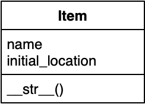
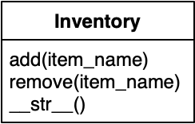

= Adventure

== tl;dr

. Implement Crowther's Adventure game using OOP in Python.
. Play your game!

== Background

Back in the days, before dedicated graphics cards were a thing, text-based adventure games were incredibly popular. This type of game consists entirely out of text, and is traversed by commands much like the ones you would enter in the terminal.
One such game is Colossal Cave Adventure, created by link:https://en.wikipedia.org/wiki/William_Crowther_(programmer)[William Crowther] in 1975, that served as the inspiration for the text adventure game genre.

In Adventure you have to navigate between "Rooms" through commands such as "WEST" and "EAST", but also "IN" or "OUT".
Like so:
----
    You are standing at the end of a road before a small brick
    building. A small stream flows out of the building and
    down a gully to the south. A road runs up a small hill
    to the west.
    > WEST
    You are at the end of a road at the top of a small hill.
    You can see a small building in the valley to the east.
    > EAST
    Outside building.
    >
----

But there is more than just navigating, at all times you can ask for `HELP` for an explanation of the game, or `LOOK` to get a detailed description of the room you are in.
From the previous example you could see that the second time a room is entered a shorter description was shown. If we were to use look we would see the following:
----
    > LOOK
    You are standing at the end of a road before a small brick
    building. A small stream flows out of the building and
    down a gully to the south. A road runs up a small hill
    to the west.
    >
----

Besides moving and looking there is also interaction with items. These items are located within rooms and are yours to take and drop (`TAKE` <item>, `DROP` <item>).

Forgot what you've picked up throughout your journey? Using the `INVENTORY` command you get a list of what you're carrying around. Interacting with items would look like this:
----
    Inside building
    You are inside a building, a well house for a large spring.
    There is a a set of keys here
    > TAKE keys
    Taken.
    > INVENTORY
    KEYS, a set of keys
    > DROP keys
    Dropped.
    > INVENTORY
    inventory is empty.
    >
----

Use these items to pass otherwise unpassable blockades, such as the "strong steel grate".

== Distribution

=== Downloading

[source,subs="macros"]
----
$ wget https://cs50x.mprog.nl/course/problems/adventure/adventure.zip
$ unzip adventure.zip
$ rm adventure.zip
$ cd adventure
$ ls
adventure.py  data/  room.py
----

=== Understanding

Though Crowther originally wrote his game in Fortran, an imperative programming language that has been around since the 1950s, we will be taking a more modern aproach to its implementation, making your first foray into Object-Oriented Programming (OOP). Instead of having your main function keep track of all relevant variables and states we'll break up the logic over a variety of classes.
We've gone ahead and made a basic setup for you. The player and room classes have been seperated from the main file, but it's up to you to implement their unfinished methods.

Keeping code seperated is a key part of OOP, and makes your code more easily readable and maintainable. See for yourself!

==== `data/`

In the data folder are 6 datafiles with which you can create 3 versions of Adventure:

- `TinyRooms.txt` and `TinyItems.txt` together are the smallest adventure game, consisting of 3 rooms and 2 items. Great for starting out with!

- `SmallRooms.txt` and `SmallItems.txt` are a bit larger and include some more advanced interactions.

- Lastly, the full original Adventure is contained within `CrowtherRooms.txt` and `CrowtherItems.txt`.

==== `adventure.py`

Take a look at `adventure.py`. The file currently has three components:

- an `import` statement
- an `Adventure` class
- an `if __name__ == "__main__"` part

Instead of working from a single file, we've split up our classes into seperate files. This keeps our files short and tidy, but we'll still have to link them up. For that we'll have to import them as follows:

[source]
----
from room import Room
----

This line ensures that the `Room` class from `room.py` is available to use from `adventure.py`, which makes it possible to instantiate `Room`-type objects for use in the adventure game:

----
Room(3, 'Inside building', 'You are inside a building, a well house for a large spring.')
----

Inside the `Adventure` class are a couple of methods that make the game work.

You'll be creating `Room` objects in the `load_rooms` method, though for now it is little more than a `TODO`.

The `won` method will eventually decide if the game has been won by the player.

Moving around in the game is handled by the `move` method. Here you'll make use of the room objects you've created earlier.

The `play` method contains the main loop that makes your game playable. One important part of this is translating commands given by your player into method calls that handle the actions. We've already given you a headstart here. See how we check if a command is a "direction" like `EAST` or `WEST`?

==== `room.py`

This is your `Room` class, where al code related to rooms will be collected. It is still mostly empty!

== Step 1: Loading and moving around

=== Parsing data files

`TinyRooms.txt`, the smallest version of the game, contains the following data:
----
1
Outside building
You are standing at the end of a road before a small brick
building.  A small stream flows out of the building and
down a gully to the south.  A road runs up a small hill
to the west.
-----
WEST     2
UP       2
NORTH    3
IN       3

2
End of road
You are at the end of a road at the top of a small hill.
You can see a small building in the valley to the east.
-----
EAST     1
DOWN     1

3
Inside building
You are inside a building, a well house for a large spring.
-----
SOUTH     1
OUT       1
----

These are the details for all rooms in the game and how to navigate between them. Each room consists of 4 parts:
----
  <id>
  <name>
  <description>
  ---
  <routes>
----

A `<routes>` line contains both a <direction> and an <id>. For example, `Room 2 - End of road` is connected to room `1 - Outside building` by directions 'EAST' and 'DOWN'.

You'll find that the name is actually a short description of the room, whereas the 'description' is fully descriptive. Keep this in mind for later parts of the game!
First we'll have to parse this data into our program. Since a room is a bit more complicated than a simple string or integer we have set you up with a class named Room in room.py.

In adventure.py you'll find the `load_rooms` method. As you can see we've already opened the file for you, but you'll have to do the parsing part.

Implement the `Room` class and `load_rooms` method so that each room from `TinyRooms.txt` is instantiated as a Room object. Start with `id`, `name` and `description` and, for now, leave out the routes to other rooms.

Hint: To parse the file, analyse precisely how the file is formatted. What recurring elements do you see that seperate data entries?

Hint: When reading lines, your string may contain extra newlines from the data file. You can strip these extra characters using standard Python methods!


=== Moving around

Now that we have a couple of rooms, we can almost start playing the game. But we left out connections from room to room, so we can't really move yet!

In the `Room` class, add an attribute to hold connections. What kind of Python data structure can you use for this?

Then, add code to the `load_rooms` method in `Adventure` to read the connections from the data file and add those to the `Room` objects.

Next, add a method to the `Room` class that can be used to see if the given command is a valid move.

Now, we can create a `current_room` attribute in `Adventure` to keep track of where our player is. Make sure to initialize that to the room with id 1 at the start of the game, and to update it in the `move()` method.

Hint: Always check for a valid connection when attempting to move. I.E. Can we `move` "EAST" from the first room? If not, let the player know they tried an "Invalid command".

You can test moving around by adding the following code to `if __name__ == '__main__'`:
----
  adventure.move("WEST") # should move to the 'room 2' object
  print(adventure.current_room) # should print room 2: "End of road"
  adventure.move("DOWN") # should move to the 'room 1' object
  adventure.move("IN") # should move to the 'room 3' object
  print(adventure.current_room) # should print room 3: "Inside building"
----

Make sure this works before going on!


=== Prompt for commands

Time for your first steps into making this a game; have players give commands.

Remove the code used to test moving around from the `if __name__ == '__main__'` and instead add `adventure.play()`.
Now when you run the script you should be met with a welcome message and be prompted for a command. But alas, not much happens when actually entering such a command!

Each time a player enters a room for the first time, we'll provide them with a full description of the room.
Following the description we'll prompt the player for a command. The '>' will mark this prompt. It should look like this:
----
  You are standing at the end of a road before a small brick
  building.  A small stream flows out of the building and
  down a gully to the south.  A road runs up a small hill
  to the west.
  >
----

If the player attempts a command that cannot be executed tell them they attempted an "Invalid command." and prompt for another command using the '>'.
Like so:
----
  > OUT
  Invalid command.
  >
----

If a player enters a room they've already seen, only give them the short description. How should we keep track of that?

Check the `SmallSynonyms.txt` for all directions your game should be able to handle.

=== Additional commands

As a final step for making the basic game work, we'll add a few commands that make it easier to use: `QUIT`, `HELP` and `LOOK`.

`HELP` prints instructions to remind the player of their commands and how to use them.
Have it behave as follows:
----
  > HELP
  You can move by typing directions such as EAST/WEST/IN/OUT
  QUIT quits the game.
  HELP prints instructions for the game.
  INVENTORY lists the item in your inventory.
  LOOK lists the complete description of the room and its contents.
  TAKE <item> take item from the room.
  DROP <item> drop item from your inventory.
----

`QUIT` lets the player stop the game. Print `Thanks for playing!` and terminate the program cleanly.

----
  > QUIT
  Thanks for playing!
----

`LOOK` prints a full description of the room the player is currently in, even if the room was visited earlier.

----
  Inside building
  > LOOK
  You are inside a building, a well house for a large spring.
----


== Step 2: Finding and picking up items

Now that a player can move between rooms, it's time to implement some of the more advanced features of the game.

In this stage, we're going to add items to the game for the player to pick up and interact with.

=== Adding items

Items in Adventure have a name, description and location. To add these items to the game, you will need to add code that parses an extra data file. You can find them inside the `TinyItems.txt`, `SmallItems.txt` and `CrowtherItems.txt`. The formatting of the files is similar to that of the room files.

`TinyItems.txt` contains the following data:
----
  KEYS
  a set of keys
  3

  LAMP
  a brightly shining brass lamp
  2
----

These are the details for all items in the Tiny game. Each item consists of 3 parts:
----
  <name>
  <description>
  <initial_room_id>
----
Here `<initial_room_id>` is the id for the room where the item can initially be found.

Just like rooms, items all share the same three attributes. But unlike rooms they have little ways of interacting with the game other than just being there.
That's what makes them quite suited for a data class, per the following diagram.



Implement the `Item` class by creating a new Python source file, and add code to load items and instantiate them at the start of a game. Don't forget to `import` your new file into `adventure.py`!

=== Holding items

Items can be either located in the rooms inventory or the players inventory.
To do so, let's set up an `Inventory` class to manage those items for both the player and the rooms.

The following UML diagram describes the methods that should be in your class, but the data fields are yours to figure out.



As you can see the inventory only has methods that it displays publicly. Its attributes are kept private, and are only meant to be accessed through these methods.
Make sure you can add and remove items using their names from the inventory.

=== Placing items

First add an inventory to each room you create, so they can hold an item when they're created.
Now, when you load the items, place them in the room they should initially be in.

Use the initial room id of the item to find the correct room. Then use the methods of the rooms inventory class to add the items!

=== Finding items

When a player visits a room with one or more items the game will have to let the player know which items there are in addition to the description of the room:
----
  You are inside a building, a well house for a large spring.
  KEYS: a set of keys
----

It is formatted as follows:
  <description>
  <item_1>
  <item_2>
  etc.

Don't forget to add this feature to the `LOOK` coomand!

=== Taking and dropping items

Now implement the `TAKE` <item> command. By use of `TAKE` the player can pick up an item from a room they're in. In other words, the item moves from a room to the player.
Notice how the command consists of two parts, instead of just the one for moving in a direction. You might want to either split the user input to recognize a `TAKE` or `DROP` command.
Implement an `Adventure.take()` method that transfers an item for the inventory of a room to the inventory of the player.

Of course there is some error catching to do, what happens for instance if a player takes something that is not in the room? Or an item that is located inside a room the player is not currently in?
Both cases should be met by printing "`No such item.`" Resulting in the following gameplay:
----
  You are inside a building, a well house for a large spring.
  KEYS: a set of keys
  > TAKE KEYS
  KEYS taken.
  > TAKE KEYS
  No such item.
  > TAKE SOMETHING
  No such item.
  >
----

Any item the player picks up, they can also leave behind using the `DROP` command. The item's location then transfers from the player to the room they are currently in (no throwing items to other rooms!).
Once again if a player were to drop an item not in their possession they are met with "`No such item.`".

Dropping items looks alot like picking them up:
----
  You are inside a building, a well house for a large spring.
  KEYS: a set of keys
  > TAKE KEYS
  KEYS taken.
  > DROP KEYS
  KEYS dropped.
  > DROP KEYS
  No such item.
  > TAKE KEYS
  KEYS taken.
----

Make sure you can pick up items that you previously dropped!

For the player to keep track of their owned items you'll have to implement the `INVENTORY` command.
It should print all items currently owned by the player, like this:
----
  > INVENTORY
  KEYS: a set of keys
  LAMP: a brightly shining brass lamp
  > DROP KEYS
  KEYS dropped.
  > INVENTORY
  LAMP: a brightly shining brass lamp
  > DROP LAMP
  LAMP dropped.
  > INVENTORY
  Your inventory is empty.
  >
----

== Step 3: Conditional movement

Time to step up our game. Let's get started on the Small version of adventure.
Small has items as well as interaction with those items. In `SmallRooms.txt` you'll find some rooms actually have an item listed in their routes.

Below you see such a room. You might need to revisit the `load_rooms` method to adapt to these connections.
You'll need these new routes for the next part; conditional movements.
----
  6
  Outside grate
  You are in a 25-foot depression floored with bare dirt. Set into the dirt is a strong steel grate mounted in concrete.  A dry streambed leads into the depression from the north.
  -----
  NORTH      5
  UP         5
  DOWN       8/KEYS
  DOWN       7
----

Moving to a room can now depend on items being in the inventory of the player. Room 6, for instance, allows access to rooms 7 and 8 through the same movement `DOWN`, depending on whether the player owns the keys. To progress in the game the player will first need to find the keys.

Only one condition can exist per movements and it is always an item. So if a room has a direction with multiple conditions, the data file has an entry for each condition. If the player has the required item, the conditional movement is always made; it is not an optional movement.

In case of multiple conditions and the player meeting all requirements just follow the order they appear in the data file, meaning the top-most condition is checked first.

This makes moving around a bit more complicated. Aside from only checking that the direction is connected to a room, you'll now have to check for the item conditions.
Depending on your earlier implementation of moving, you might have to slightly alter your code.

Why conditional movements you ask? Well, you can use them to have the 'same' room show a different description. Instead of having a conditional description, displaying one of more descriptions based on the items you have on you, you just move to a different room.
This may be easier to understand with the following example. If you forget to bring a lamp into the dark room, all you see is darkness. Whereas bringing the lamp shows you exactly what is in the room. Technically it is the same room, with two different descriptions, but in the code we've turned it into two seperate rooms. This makes it easy to add as many conditional movements for a room as we'd like.

A conditional movement would look like this:
----
  You are crawling over cobbles in a low east/west passage.
  There is a dim light to the east.
  > DROP LAMP
  LAMP dropped.
  > WEST
  It is now pitch dark.  If you proceed you will likely fall
  into a pit.
  > EAST
  Cobble crawl
  LAMP: a brightly shining brass lamp
  > TAKE LAMP
  LAMP taken.
  > EAST
  You are in a debris room filled with stuff washed in from
  the surface.  A low wide passage with cobbles becomes
  plugged with mud and debris here, but an extremely narrow
  canyon leads upward and west.  Unfortunately, the passage
  is blocked by a barrier marked "Under Construction."
  >
----

== Step 4: forced movement

Sometimes a player will attempt a movement they cannot make yet, because they are missing the required item. Passing the steel grate in room 6 for example requires keys.
Instead of printing a custom message, we'll have the player move into a special sort of room. This room displays a description for what happened, and then forcefully moves the player to where the forced movement points.
This move happpens automatically and immediately after printing the full description.

Another example of forced movements can be found in the Crowther rooms 70 through 75. These rooms even have a conditional `FORCED` movement. These are the final few rooms, if all required items are owned the player will win the game and go to room 77. If not, the player continues to room 76 and has to try and find the remaining "`treasures`". The interesting part is that rooms 70 through 75 are devoid of a description! This makes it possible to have conditional movement based on 6 items, even though 5 extra rooms are required to do so.

This leaves you to implement this `FORCED` movement to the game. Luckily a room with `FORCED` movement can only contain that movement and no others. So you won't have to take anything else into account when a `FORCED` move is encountered!

Being `FORCED` moved looks like this:
----
  You are in a 25-foot depression floored with bare dirt.
  Set into the dirt is a strong steel grate mounted in
  concrete.  A dry streambed leads into the depression from
  the north.
  > INVENTORY
  Your inventory is empty.
  > DOWN
  The grate is locked and you don't have any keys.
  Outside grate
  > DOWN
  The grate is locked and you don't have any keys.
  Outside grate
  >
----

Remember to always print the full description when a room `FORCED` is entered. There's no room to `LOOK` around, since the player is immediately moved by the game.

Hint: You'll most likely want to do a check each time you move to a new room. And if there's a forced movement in the new room, take a good look around and follow the forced route.

== Step 5: The winner takes all

Now that you have implemented all the features of Adventures, Crowther game is finally playable.
But let's also make it winnable. For example, in the `CrowtherRooms.txt` file you can see that room 77 corresponds to victory.

Implement the win condition into your game and gracefully terminate the game after attaining victory.

== Specification

Implement an Object-Oriented version of Crowther's Adventure game.
- Implement methods for loading data into objects.
- The game should make use of the room, item and inventory classes.
- The game should prompt the user for commands and either execute those or warn about a non-existent command.
- The game must be winnable.

=== `style50`

```
style50 adventure.py
style50 room.py
```
