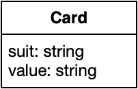
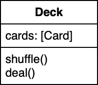

# Game of Cards

Object-oriented programming is commonly used to model real-world things, like cars or businesses, as well as their behaviors and interactions. Each class represents a "kind of thing" and bundles relevant functionality in the form of methods. In this lab, you'll model a deck of 52 playing cards.




## Card: a data class

Let's create a `Card` class first. For this lab, a `Card` is very simple *data class*: it only contains a few attributes, as well as the method necessary to fill those.

In this case, the attributes will contain the minimum of information needed to uniquely define what kind of card it is:

- the suit, or color, of the card (like Spades :spades:)
- the value of the card (2, 3, A, J, ...)

In UML, the class looks like this:



**Write** a declaration for the `Card` class. In the editor to the right, add it to `cardgame.py`.


Use the following syntax:

    class ClassName(object):

First the `class` keyword, then the name of your class, and finally the parent class, which is usually `object`.


After writing the declaration, press Next to go on.



## Card: the class body

Because `Card` is a data class, there are only two methods that are really needed to make it useful:

- `__init__` to set values when creating one specific object of type `Card`
- `__str__` to provide an easily readable description of the `Card` object

**First**, write an initializer that takes `suit` and `value` parameters and initializes attributes with the same name.


Use the following syntax:

    def __init__(self, attr1, ...):
        self.attr1 = attr1

In the parameter list of the `__init__` method you define for which attributes a value has to be provided. In the method body, you set the corresponding attributes via `self`. Note that `__init__` doesn't `return` anything! It just sets attributes.


**Second**, write a `__str__` method. It doesn't take any parameters other than `self` and should return a string that properly describes the object. In this case, the returned string might look like this:

    Ace of spades

where `Ace` and `spades` should be replaced by the values from `self.suit` and `self.value`.



## Card: testing

Let's test your class! Below the class definition, add a line of code:

    if __name__ == "__main__":

Anything that's inside this `if` will only be executed if we run the file directly from the command line using `python cardgame.py`.

In the `if`, **write** a few statements to create `Card` objects.


Use the following syntax:

    var1 = ClassName(...)

This assigns a new object of type `ClassName` to the variable `var1`. In the place of the `...` you should provided the required parameters for the initializer.


And after those statements, **add** a few statements that print the objects from the variables you created.


Use the following syntax:

    print(var1)

When used like this, `print` will automatically use the `__str__` method that you wrote to provide a human-readable print of the object contents.


Now try it out! In the Terminal, **run** `python cardgame.py` and verify the results.



## Deck: a class that contains cards

In this lab, a Deck will be a standard deck of hearts, diamonds, clubs and spades, with values Ace through King. It will have methods to shuffle, and to deal one card out of the deck:



**Add** a declaration for the `Deck` class to your code. Then, **add** an initializer. The initializer doesn't take any arguments besides `self`, because a `Deck` will always be the same.

The initializer is a good place for default values. Let us provide you with the declarations of two important attributes for this class:

    self.suits = ['Hearts','Diamonds','Clubs','Spades']
    self.values = ['A','2','3','4','5','6','7','8','9','10','J','Q','K']

**Copy** those declarations into your initializer.



## Deck: instantiating cards

With those `suits` and `values`, the `Deck` class can now create a `Card` instance for each of 52 combinations. Write code to generate those `Card`s and add them to an attribute called `cards.`

It's possible to generate all cards and add them to the `cards` variable using a single line of code. However, it is no problem to use a few more! Make it work first, then optimize.


Here is one suggestion for the pseudocode:

    create empty list of cards
    for each suit do
        for each value do
            create new Card with that combination
            add it to the list




## Deck: testing

**Add** a `__str__` method to `Deck`:

    return f"{len(self.cards)} cards in the deck"

Now you can test the class. Go to the `if __name__ == "__main__"` section of your program and **replace** the contents. Just create one instance of a `Deck` and print it:

    deck = Deck()
    print(deck)

When run, your program will hopefully print that the deck contains 52 cards!



## Deck: shuffle

The first of our main methods for the `Deck` class is `shuffle`. It should take the list of `Card`s and shuffle it pseudorandomly.

**First**, import a useful method that comes with Python. It's actually called `shuffle`! Add the following line at the top of your program:

    import random

**Second**, write a `shuffle` method for the `Deck` class. It should do nothing other than call the `random.shuffle` with the `cards` as a parameter. This will provide shuffling functionality for your class, and *delegate* that functionality to another (Python-provided) module.


`random.shuffle` can be used to shuffle lists like this:

```python
import random
numbers = [1, 2, 3, 4, 5]
random.shuffle(numbers)
print(numbers)
[2, 3, 1, 4, 5]
```

Have a look at the [Python docs](https://docs.python.org/3/library/random.html#random.shuffle) for more information.


With the code that you have now, you can't really test if the `shuffle` method works correctly. You could test one property, though: after shuffling, the deck should still have 52 cards. Change your test code to create a `Deck`, call `shuffle` on it, and then print it. Is everything correct?



## Dealing

Now that the deck is shuffled, it's time to draw cards from the deck. In OOP it is common to only let classes/objects directly change their properties. In other words, their data is kept private and only through their callable methods can their properties be manipulated. This concept is called encapsulation. In our case it means that the list of cards within the deck object is managed by the deck itself.
So instead taking cards directly from the deck, we'll let the deck 'deal' them to us.

Once again create a method, this time call it `deal(self)`, that removes the top card in the self.cards list and `return`s that card. Consider cards to be stacked from first to last card as bottom to top card. Thus `deal` will have to remove the last card in the self.cards list.

Python itself already implemented a useful method within their list class, called `pop()`. Documentation can be found at https://docs.python.org/3/tutorial/datastructures.html. Use this method in your `deal(self)` method, and don't forget to actually `return` the card!

Notice how an object can be passed around and used much like any other variable can? Python actually has everything wrapped in classes. Every integer and string you've used in Python has always been an object.



## Printing

To test if shuffling the cards works as we hope it would, we're going to see what card is on top before and after shuffling. Before shuffling we expect to see the King of Spades and after shuffling we expect.. well any card really.

First let's add `card = deck.deal()` to the `if __name__ == "__main__"`, right under the creation of the deck. This should be our King of Spades, so let's check by printing. Use `print(card)` to print the card object given back by the deck's deal method.
Hmmm that's not very helpful is it? It printed something like "<__main__.Card object at 0x7f2fbb828128>", at least it should. If it didn't, retrace your steps to see what went wrong before continuing.
If your terminal output does look alike, let me explain what we're seeing. First we have the "__main__.Card object" which tells us we printed an instance (object) of type Card originating from our main file. Secondly the "at 0x7f2fbb828128" tells us where that object was allocated in memory. So, was this the King of Spades then?
To check, instead of printing the object, we could try and print its properties.
Below your earlier print statement add `print(f"{card.value} of {card.suit}")` and execute the script once more. This should print "K of Spades", it being the last card created by our initialization method.

Having to construct strings for every object each time you're printing them is rather arduous though. Preferably we want to be able to use `print(card)`. To this end, we'll have to overwrite one of python's built in methods for the Card class. It's called the `__str__(self)` method. This method is called on by the print function and always returns a string. Add it to the Card class and have it `return` the f-string we used in the print statement earlier.
Now execute the script once more and both print statements should produce the same result. If so, remove the redundant print statement, else retrace and check for mistakes.

Now test the shuffle method! Insert it just above `card = deck.deal()` and wrap the deal and print statements in a for loop like this:
```python
for i in range(5):
  card = deck.deal()
  print(card)
```
This should print 5 different playing cards in no particular order. If they are ordered, first rerun the script a couple of times. The chance of drawing a straight flush from a shuffled deck multiple times in a row is astronomically low. If you get dealt the same 5 cards multiple times, retrace and fix your mistake!



## Printing a list of objects

Naturally you would expect printing the deck would be much the same, but there's a small caveat. Try printing the deck.cards list by adding `print(deck.cards)` to the `if __name__ == "__main__"`. See how we end up with those memory locations again?

What happens is, when printing a list the re declared `__str__` method isn't called, instead the `__repr__` method is called. But before you go rewriting that method, let me first tell you that you shouldn't actually be printing lists like that in the first place. When printing a list, you should be unpacking each element and print them individually. Much like printing arrays in C, printing a list in Python is done iteratively. Add the following to the bottom of the `if __name__ == "__main__"` statement in cardgame.py:
```python
for card in deck.cards:
  print(card)
```
Now you can see how your deck is shuffled, remember the final card in the list is the top card of the deck!



## Closing Statement

These are the basics of working with objects in Python. You should now have a firmer grasp on how to define classes and what parts of your program should have its data contained within a class.

Use your understanding of these concepts to tackle your next exercise; implementing one of the earliest video games, "Adventure"!

Below you'll find an example of what your code could (or should) look like by the end of the exercise.


