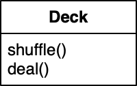

# Game of Cards

Object-oriented programming is commonly used to model real-world things, like cars or businesses, as well as their behaviors and interactions. Each class represents a "kind of thing" and bundles relevant functionality in the form of methods. In this lab, you'll model a deck of 52 playing cards.




## Card: a data class

Let's create a `Card` class first. For this lab, a `Card` is very simple *data class*: it only contains a few attributes, as well as the method necessary to fill those.

In this case, the attributes will contain the minimum of information needed to uniquely define what kind of card it is:

- the suit, or color, of the card (like Spades :spades:)
- the value of the card (2, 3, A, J, ...)

In UML, the class looks like this:


**Write** a declaration for the `Card` class. In the editor to the right, add it to `cardgame.py`. You'll write the class body in a minute!


Use the following syntax:

    class ClassName(object):

First the `class` keyword, then the name of your class, and finally the parent class, which is usually `object`.


After writing the declaration, press Next to go on.



## Card: the class body

Because `Card` is a data class, there are only two methods that are really needed to make it useful:

- `__init__` to set values when creating one specific object of type `Card`
- `__str__` to provide an easily readable description of the `Card` object

**First**, write an initializer that takes `suit` and `value` parameters and initializes attributes with the same name.


Use the following syntax:

    def __init__(self, attr1, ...):
        self.attr1 = attr1

In the parameter list of the `__init__` method you define for which attributes a value has to be provided. In the method body, you set the corresponding attributes via `self`. Note that `__init__` doesn't `return` anything! It just sets attributes.


**Second**, write a `__str__` method. It doesn't take any parameters other than `self`, and should return a string that properly describes the object. In this case, the returned string might look like this:

    Ace of spades

where `Ace` and `spades` should be replaced by the values from `self.suit` and `self.value`.



## Card: testing

Let's test your class! Below the class definition (not *in* the definition), add a line of code:

    if __name__ == "__main__":

Anything that's inside this `if` will only be executed if we run the file directly from the command line using `python cardgame.py`.

In the `if`, **write** a few statements to create `Card` objects.


Use the following syntax:

    var1 = ClassName(...)

This assigns a new object of type `ClassName` to the variable `var1`. In the place of the `...` you should provide the required parameters for the initializer. Recall which parameters are needed?


And after those statements, **add** a few statements that print the objects from the variables you created.


Use the following syntax:

    print(var1)

When used like this, `print` will automatically use the `__str__` method that you wrote to provide a human-readable print of the object contents.


Now try it out! In the Terminal, **run** `python cardgame.py` and verify the results.



## Deck: a class that contains cards

In this lab, a Deck will be a standard deck of hearts, diamonds, clubs and spades, with values Ace through King. It will have methods to shuffle, and to deal one card out of the deck:



**Add** a declaration for the `Deck` class to your code. Then, **add** an initializer. The initializer doesn't take any arguments besides `self`, because a `Deck` will always be the same.

The initializer is a good place for default values. Let us provide you with the declarations of two important attributes for this class:

    self.suits = ['Hearts','Diamonds','Clubs','Spades']
    self.values = ['A','2','3','4','5','6','7','8','9','10','J','Q','K']

**Copy** those declarations into your initializer.



## Deck: instantiating cards

With those `suits` and `values`, the `Deck` class can now create a `Card` instance for each of 52 combinations. Write code to generate those `Card`s and add them to an attribute called `cards.`

It's possible to generate all cards and add them to the `cards` variable using a single line of code. However, it is no problem to use a few more! Make it work first, then optimize.


Here is one suggestion for the pseudocode:

    create empty list of cards
    for each suit do
        for each value do
            create new Card with that combination
            add it to the list




## Deck: testing

**Add** a `__str__` method to `Deck`:

    return f"{len(self.cards)} cards in the deck"

Now you can test the class. Go to the `if __name__ == "__main__"` section of your program and **replace** the contents. Just create one instance of a `Deck` and print it:

    deck = Deck()
    print(deck)

When run, your program will hopefully print that the deck contains 52 cards!



## Deck: shuffle

The first of our main methods for the `Deck` class is `shuffle`. It should take the list of `Card`s and shuffle it pseudorandomly.

**First**, import a useful method that comes with Python. It's actually called `shuffle`! Add the following line at the top of your program:

    import random

**Second**, write a `shuffle` method for the `Deck` class. It should do nothing other than call the `random.shuffle` with the `cards` as a parameter. This will provide shuffling functionality for your class, and *delegate* that functionality to another (Python-provided) module.


`random.shuffle` can be used to shuffle lists like this:

```python
import random
numbers = [1, 2, 3, 4, 5]
random.shuffle(numbers)
print(numbers)
[2, 3, 1, 4, 5]
```

Have a look at the [Python docs](https://docs.python.org/3/library/random.html#random.shuffle) for more information.


With the code that you have now, you can't really test if the `shuffle` method works correctly. You could test one property, though: after shuffling, the deck should still have 52 cards. Change your test code to create a `Deck`, call `shuffle` on it, and then print it. Is everything correct?



## Deck: dealing

Now that the deck is shuffled, we can draw cards from the deck. **Create** a method `deal` that removes the top card from the attribute `cards` and `return` it. Removal means that after calling `deal`, the number of cards in `cards` will have decremented.

Once again, it's possible to re-use standard Python functionality to remove one `Card` from `cards`. Take a look at the docs for [Python lists](https://docs.python.org/3/tutorial/datastructures.html) and find an appropriate method to do this. Then use that method in your own `deal` method! Don't forget to actually `return` the card that you got from the deck.



## Deck: testing again

In your testing code, add

    card = deck.deal()

right after creating the `Deck`. Because the deck hasn't been shuffled yet, this card should be the King of Spades. Use `print(card)` to print the card. **Try** it out!

Now test the `shuffle` method! Call it in your testing code and verify that the shuffling is indeed pseudorandom.



## Final Checkup

Your classes now should look like this:


Note that some of the methods that you wrote aren't in this diagram. Usually, we keep everything that's not relevant out of the diagrams. But what is relevant?

To determine that, we look at classes from a "user" perspective. What information do we need to use the class well? We wouldn't need to know that `Deck` has a `cards` attribute, because `Deck` has two well-defined methods that we need to work with the deck: `shuffle` and `deal`. Everything else is *implementation detail*.

In other words, classes' data is kept private and only through their methods can their attributes be manipulated. This idea is called *encapsulation*. Exceptions are data classes, like `Card`, which are purposely designed to hold some basic data, just like a `struct` in C.

But if you're keen to check your implementation *exactly*, press Next for a UML diagram that contains all methods and attributes from an implementation perspective.



## Implementation diagram

This is what your classes should look like from an implementation perspective:


This was Game of Cards.
