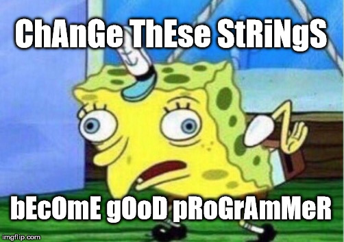

# tHe CaSe Of BoB {#bob}

## Goal

SpOnGeBoB tAlKs FuNnY, lIkE tHiS:

Create a program that turns a string into the alternating case of Spongebob.

    $ ./bob
    Type something: Know your meme
    Spongebob says: kNoW yOuR mEmE

## Specification
- Create a file called `bob.c` in your `~/workspace/section2/` directory.
- Create a program that asks for user input and changes it into alternating case. Start with lower case, and make sure to skip spaces and punctuation.
- Compile the program with the command `make bob`.
